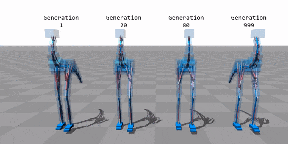

# Genetic Algorithm

This site goes over genetic algorithms (GAs), describing what exactly they are, how we've implemented one, and how to use our implementation.

As a sort of silly example, here is a GIF of a biped learning to walk by optimizing muscle movement via a genetic algorithm.

.

For the full original video, visit [this link](https://www.youtube.com/watch?v=pgaEE27nsQw).