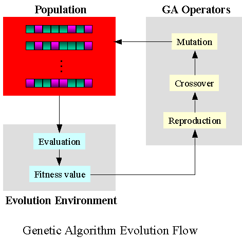

# Genetic Algorithm Basics
{:.no_toc}

* TOC 
{:toc}

## Overview

This page goes over the basics of genetic algorithms. What are they, what are they used for, and how do we use them?

Note: Much of this information was heavily borrowed from the Wikipedia article for genetic algorithms.

## What Are Genetic Algorithms?

To help answer this question, let's borrow some of the information from [Wikipedia's Genetic Algorithm](https://en.wikipedia.org/wiki/Genetic_algorithm) article, a genetic algorithm (GA) is an algorithm inspired by natural selection that belongs to the larger class of evolutionary algorithms (EA). Genetic algorithms rely on biologically-inspired operations like mutation, crossing over of "alleles", and selection of the fittest to "survive". Don't feel bad if this seems intimidating. All that you need to know is that GAs are a technologically clever way to approach optimization problems.

In GAs a population of candidate solutions (called individuals, creatures, or phenotypes) to an optimization problem is *evolved* toward better solutions. Each candidate solution has a set of properties (its chromosomes, genotype, or alleles) which are mutated and altered - just like in real life - to adapt to fitting the optimization problem better.

### What Are The Steps Of A Genetic Algorithm?

In the following visualization and list, we've broken down the steps of a GA:

1. Generate your population of candidate solutions (called individuals, creatures, or phenotypes). Each iteration of the genetic algorithm gives a new *generation*.
2. For each individual in the generation, evaluate the problem you are wishing to optimize and assess their *fitness*, typically by calculating the value of the objective function (or how close the individual's solution is to the target solution).
3. If the fitness is within the objective function tolerance you have described, quit the genetic algorithm. Congrats! You've completed the GA optimization.
4. Else, *stochastically* select `n` individuals to reproduce and form the new generation. Note, when we say "reproduce" here, we mean that we choose the `n` best individuals to "carry on their genome". (Remember that 'genome' here actually means their set of parameters.)
   1. Crossover the 'alleles' for the individuals' offspring.
      1. This crossing over can be a bit complicated. In essence, we're blending the two 'genomes' (parameter sets) of the two parents into multiple offspring that have unique genomes of their own, just like in life!
   2. Select a subset of the offspring to undergo mutations.
      1. These mutations are random and are not common, but nonetheless are important to GAs. Mutations manifest as a modification of a parameter value that would not have originally occurred given the new individual's parents. This often helps the GA to get out of local minima that would have otherwise caused the GA to converge to a non-optimal solution.
5. Return to step 2.
